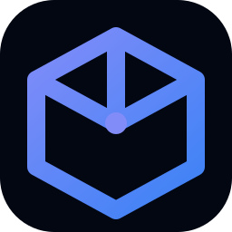

<div align="center">
  
  <h1>IdeaBox</h1>
  <p>A beautiful, local-first workspace for capturing and evolving your creative ideas.</p>
</div>

---

## ⚡️ What's Inside

IdeaBox is a personal workspace that helps you organize your scattered thoughts and side projects. Instead of feeling overwhelmed by a pile of unfinished ideas, IdeaBox makes it fun to capture, explore, and actually build them.

- **Instant Capture**: Jot down ideas before they fade.
- **Workflow Pipeline**: Move ideas through Capture → Explore → Build.
- **Local-First**: Everything is saved to your browser instantly using Zustand and LocalStorage. No databases.
- **Premium Aesthetics**: Built with Framer Motion, TailwindCSS v4, and custom Glassmorphic utilities for a buttery-smooth experience.
- **Lightning Fast**: Built on Vite + React + TypeScript.

## 🛠 Tech Stack

- **Framework**: React 18
- **Bundler**: Vite
- **Styling**: TailwindCSS v4 + Vanilla CSS Variables (Glassmorphism)
- **Animations**: Framer Motion
- **State**: Zustand (with Persist middleware)
- **Routing**: React Router
- **Icons**: Lucide React

## 🚀 Getting Started

```bash
# Install dependencies
npm install

# Start the development server
npm run dev

# Build for production
npm run build
```

## 🔮 Future Scope (What's Next)

- **JSON Import/Export**: Back up your ideas to a JSON file and restore them across devices.
- **Canvas View**: A freeform node-based view for connecting related ideas visually.
- **Markdown Support**: Rich text editing for the Explore phase.
- **PWA Support**: Install IdeaBox directly to your desktop or mobile home screen.

---

*IdeaBox was built as a personal passion project. You are welcome to fork, explore, and use it for your own ideas—just please provide attribution if you share or build upon it!*
